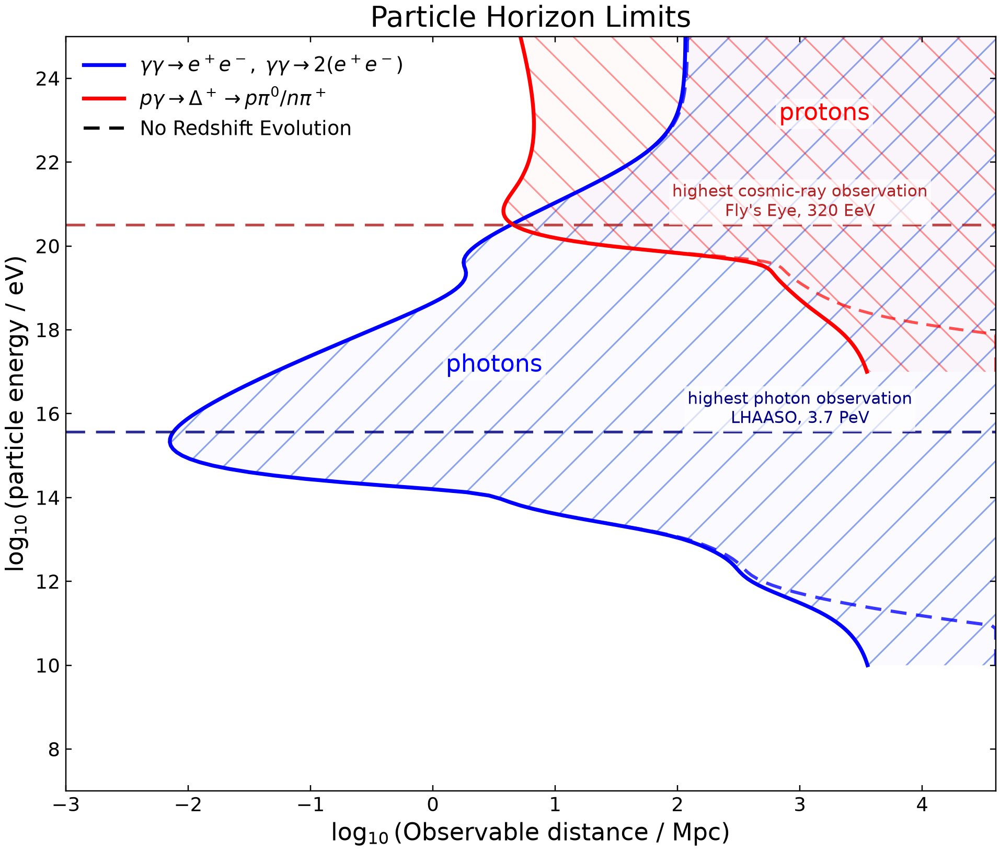
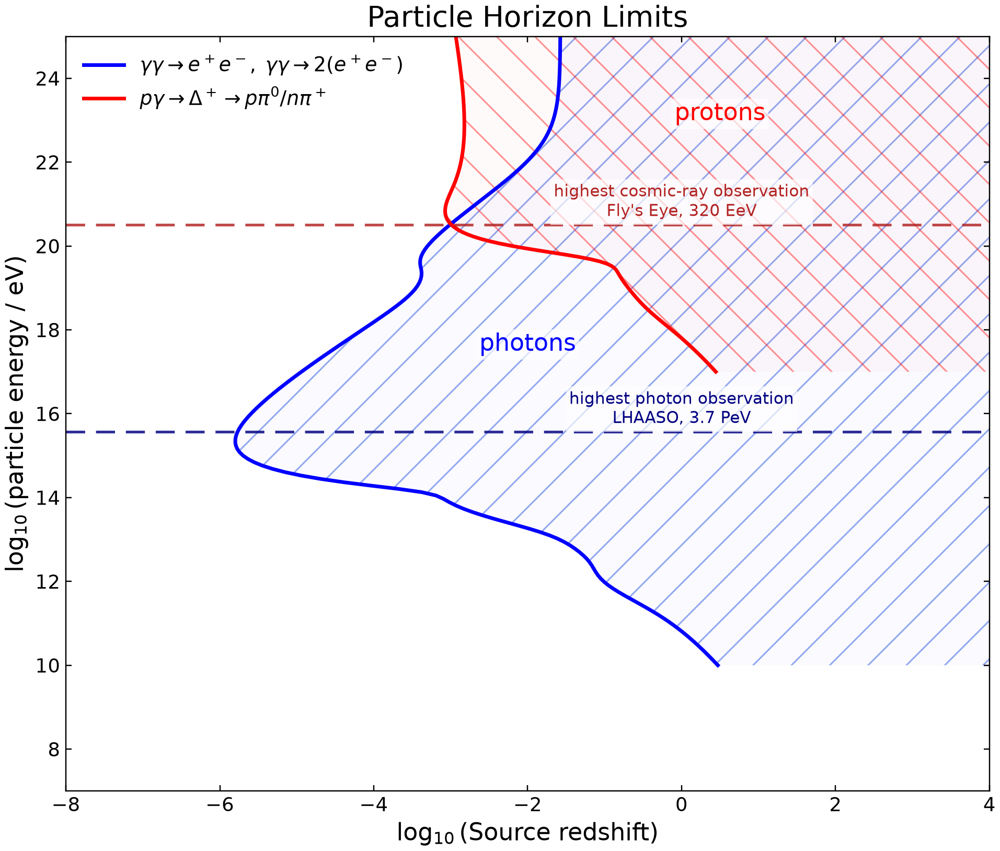

# Cosmic Particle Horizon from Background Interactions

<table>
  <tr>
    <td></td>
    <td></td>
  </tr>
</table>

This package creates plots for cosmic propagation limits, or horizons, from particles interacting with cosmological thermal backgrounds (e.g. CMB and CνB). The plot form-factors follow the form of cosmic horizon plots produced by Peter Gorham (I cannot find an original publication of the figure, however several sources in ultrahigh energy neutrinos including the plot give courtesy to Peter Gorham).

The physics backend for photon and cosmic-ray processes is built from [CRPropa3-data](https://github.com/CRPropa/CRPropa3-data). Neutrino absorption is implemented separately from the analytic approximation used by [Ruffini, Vereshchagin, and Xue](https://arxiv.org/pdf/1503.07749), following [Lunardini, Sabancilar, and Yang](https://arxiv.org/pdf/1306.1808) for the underlying CνB absorption formalism.

## Defining Particle Horizons

The particle-horizon definitions used here follow Ruffini, Vereshchagin, and Xue, *Cosmic absorption of ultra high energy particles*, Astrophys. Space Sci. 361, 82 (2016), Secs. 3–4, https://arxiv.org/pdf/1503.07749. 

A particle horizon is defined by the condition that the accumulated optical depth reaches unity for a particle propagating through cosmological background radiation fields:

$$\tau = 1 ~.$$

Without cosmological redshift evolution, the horizon is equivalent to the particle’s mean free path.

$$\lambda(E) = \frac{1}{\sigma(E)~n} ~,$$

or, equivalently for the CRPropa-derived local interaction rates used here,

$$\lambda(E) = \frac{1}{\Gamma_0(E)} ~,$$

where $\Gamma_0(E)$ is the local $z = 0$ interaction rate in units of `Mpc^-1`.

### Including Cosmological Redshift Evolution

Outlined in the paper above, we can extend the propagation to include effects of redshift, both for evolution of the traveling particle and the cosmological backgrounds. Still, the horizon is defined at

$$\tau(E_0, z_h) = 1~,$$

now with an optical-depth integral of the form

$$\tau(E_0, z_h) =\int_0^{z_h}\Gamma \left( E_0(1+z')^2\right) (1+z')^3\frac{D_H~dz'}{(1+z')~\mathcal{H}(z')} ~,$$

where $E_0$ is the particle energy observed today, $D_H = c/H_0$, and

$$\mathcal{H}(z) = [\Omega_r(1+z)^4 + \Omega_M(1+z)^3 + \Omega_\Lambda]^{1/2} ~.$$

In this implementation, $\Gamma(E)$ is evaluated from local CRPropa rate tables and scaled by the background-density factor $(1+z)^3$; the shifted argument $E_0(1+z')^2$ reflects the combined redshifting of the propagating particle and background energy scales.

For the neutrino horizon, Ruffini et al. use the CνB number-density scaling and the at-rest CνB approximation,

$$\tau_{\nu\bar{\nu}}(E_0,z_h)=n_{0,\nu}D_H\int_0^{z_h}\sigma_{\nu\bar{\nu}}\left( E_0(1+z')\right)\frac{(1+z')^2dz'}{\mathcal{H}(z')} ~.$$

This differs from the CRPropa photon/proton/nuclei scaling because the target is the relic neutrino background and the Ruffini implementation evaluates the beam energy as $E'=E_0(1+z')$.

For interactions where the primary particle is not annihilated and does not lose a significant fraction of its energy in a single interaction, the mean free path is not itself the appropriate horizon scale. Ruffini et al. instead define a mean energy-loss distance,

$$\tilde{\lambda}^{-1} = \frac{1}{E} \frac{dE}{c ~ dt} ~,$$

and the corresponding accumulated energy-loss depth,

$$\tilde{\tau}=\int_0^t\frac{c ~ dt'}{\tilde{\lambda}}=D_H\int_0^z\frac{dz'}{\tilde{\lambda}(z')(1+z')\mathcal{H}(z')} ~.$$


## Contributing Physics Processes

### Photons

- Pair production: `γγ → e⁺e⁻`
- Double pair production: `γγ → 2(e⁺e⁻)`

Both photon processes remove the primary photon; the photon horizon uses the sum of the two CRPropa-derived absorption rates.

### Protons

- Photopion production: `pγ → Δ⁺ → pπ⁰ / nπ⁺`
- Pair production: `pγ → pe⁺e⁻`

The neutral pion channel produces photon secondaries through `π⁰ → γγ`; the charged pion channel produces leptonic and neutrino secondaries through the usual pion/muon decay chain. The proton curve includes the photopion interaction mean-free-path contribution and the electron-pair-production mean energy-loss contribution.

### Iron Nuclei

- Photodisintegration: `⁵⁶Fe + γ → nuclear fragments`
- Elastic scattering: `⁵⁶Fe + γ → ⁵⁶Fe + γ`

The iron curve is an Fe-56 interaction horizon built from CRPropa3-data nuclear tables. Photodisintegration changes the nuclear species directly; elastic scattering is included as an additional interaction-depth contribution for the iron line.

### Neutrinos

- Resonant annihilation: `νν̄ → Z⁰ → f f̄`
- Non-resonant scattering: smooth high-energy `νν̄` contribution

The neutrino curve is shown only in the redshift plot. It follows Ruffini et al.'s analytic implementation with the reference neutrino mass `mν = 0.08 eV`, CνB density scaling, the small-momentum Breit-Wigner resonance approximation, and the non-resonant high-energy approximation.

## Model Choices

- CRPropa data source: local checkout of `CRPropa3-data`.
- Photon backgrounds: `CMB`, `EBL_Saldana21`, and `URB_Fixsen11`.
- Photon interaction grid: CRPropa electromagnetic cross sections sampled on a `2^18 + 1` Romberg grid, with a field-aware upper `s_kin` bound that extends beyond CRPropa's default to energy range to `10^25 eV`.
- Proton photopion cross section: full shipped `tables/PPP/xs_proton.txt` table, regridded to `2^12 + 1` log-spaced samples for CRPropa's Romberg integration.
- Iron nucleus: Fe-56 uses CRPropa3-data TALYS photodisintegration and elastic-scattering tables.
- Neutrino absorption: Ruffini et al. derivation - `mν = 0.08 eV`, `nCνB = 112 cm⁻³`, resonant Eq. 2.12 and non-resonant Eq. 2.14 from Ruffini et al.; thermal CνB momentum convolution from Lunardini et al. is documented but not included.
- Particle energy ranges: photons use `10^10` to `10^25 eV`; protons, iron, and neutrinos use `10^17` to `10^25 eV`.
- Horizon integration range: photon/proton/iron redshift integration uses `z_max = 40`; neutrino integration uses `z_max = 3000`.

## Record Energy Observations

- Cosmic-ray/proton proxy: Fly's Eye "Oh-My-God" event, $320 \pm 90$ EeV; primary identity is not uniquely proton (Bird et al. 1995, https://doi.org/10.1086/175845)
- Photon: LHAASO Cygnus X-3 candidate spectrum extending to about $3.73 \pm 0.41$ PeV, used as the latest high-energy gamma-ray line (LHAASO Collaboration 2025, https://arxiv.org/abs/2512.16638)
- Neutrino: KM3NeT event `KM3-230213A`, approximate neutrino energy $220^{+570}_{-110}$ PeV (KM3NeT Collaboration 2025, https://doi.org/10.1038/s41586-024-08543-1)

## Install

Clone the repository with its CRPropa3-data submodule:

```bash
git clone --recurse-submodules https://github.com/ZackAshM/cosmiclimits/
cd cosmiclimits
```

If the repository was cloned without submodules, initialize them from the project root:

```bash
git submodule update --init --recursive
```

Create the local virtual environment and install the Python dependencies:

```bash
python3 -m venv .venv
.venv/bin/python -m pip install --upgrade pip
.venv/bin/python -m pip install -e .
```

The compiled CRPropa Python package is not required for these plots. This project uses the local `data/CRPropa3-data` submodule as the physics-data backend.

## Usage

Run the plotter script from the project root:

```bash
.venv/bin/python scripts/plot.py
```

Plot results are written inside `output/`:

- `cosmic_limits_mpc.png`
- `cosmic_limits_redshift.png`
- `computed_horizons.csv`

Modules:

- `data/crpropa_runtime.py`: registers the local CRPropa3-data checkout and imports CRPropa data-generation modules.
- `cosmiclimits/backgrounds.py`: selects the shared CRPropa photon background fields.
- `cosmiclimits/photon/`: wraps CRPropa photon pair-production and double-pair-production rate calculations.
- `cosmiclimits/proton/`: wraps CRPropa proton photopion and electron-pair-production calculations.
- `cosmiclimits/nuclei/`: wraps CRPropa Fe-56 photodisintegration and elastic-scattering calculations.
- `cosmiclimits/neutrino/`: implements analytic UHE neutrino absorption on the CνB following Ruffini et al.
- `cosmiclimits/horizon.py`: solves the depth-equals-one horizon condition and converts redshift to observable distance.
- `cosmiclimits/utils.py`: stores/interpolates generated rate tables.
- `scripts/plot.py`: computes the curves, draws figures, and writes the CSV table.


## AI-Usage Disclaimer

The code packaged here is generated using OpenAI’s Codex, with human review from myself (Zachary Martin). I heavily orchestrated the physics backend decisions, including the choice for defining a “horizon” based on energy-loss depth that could include expansion (redshift) effects, as well as which thermal models to include. I have included, in this README, all physics decisions made here in order to make interpretation of the results as clear as possible. The project organization is also orchestrated by myself, including the structure of submodules, and code documentation. 

Codex was used to write wrappers for interaction-table generation + calculated propagation rates of interactions using the CRPropa3-data package, and for writing computational versions of the equations presented in Ruffini et al. 
